# Luminar Threat Intelligence Feed - Microsoft Sentinel

## Overview

**Cognyte** is a global leader in security analytics software that empowers governments and enterprises with Actionable Intelligence for a safer world. Our open software fuses, analyzes and visualizes disparate data sets at scale to help security organizations find the needles in the haystacks. Over 1,000 government and enterprise customers in more than 100 countries rely on Cognyte’s solutions to accelerate security investigations and connect the dots to successfully identify, neutralize, and prevent threats to national security, business continuity and cyber security. 

Luminar is an asset-based cybersecurity intelligence platform that empowers enterprise organizations to build and maintain a proactive threat intelligence operation that enables to anticipate and mitigate cyber threats, reduce risk, and enhance security resilience. Luminar enables security teams to define a customized, dynamic monitoring plan to uncover malicious activity in its earliest stages on all layers of the Web. 

**Luminar Threat Intelligence** App allows integration of intelligence-based IOC data, customer-related leaked records identified by Luminar.

## Requirements
- Microsoft Sentinel.
- Luminar API Credentials.
- Microsoft Azure
  1. Azure functions with Flex Consumption plan.
     Reference: https://learn.microsoft.com/en-us/azure/azure-functions/flex-consumption-plan
	 **Note: Flex Consumption plans are not available in all regions, please check if the region your are deploying the function is supported, if not we suggest you to deploy the function app with premium plan. **
	 Reference: https://learn.microsoft.com/en-us/azure/azure-functions/flex-consumption-how-to?tabs=azure-cli%2Cvs-code-publish&pivots=programming-language-python#view-currently-supported-regions
  2. Azure functions Premium plan.
	 Reference: https://learn.microsoft.com/en-us/azure/azure-functions/functions-premium-plan

     
## Microsoft Sentinel

### Creating Application for API Access

- Open [https://portal.azure.com/](https://portal.azure.com) and search `App registrations` service.

- Click `New registration`.
  
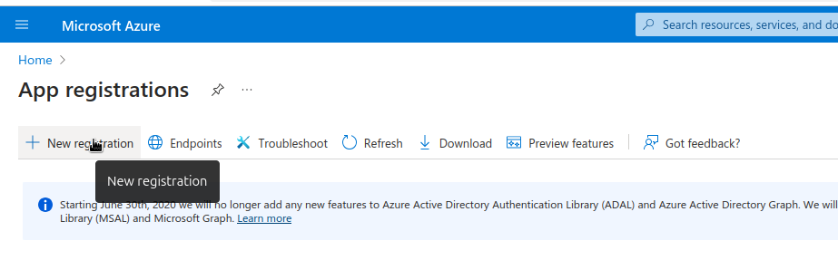

- Enter the name of application and select supported account types and click on `Register`.
  
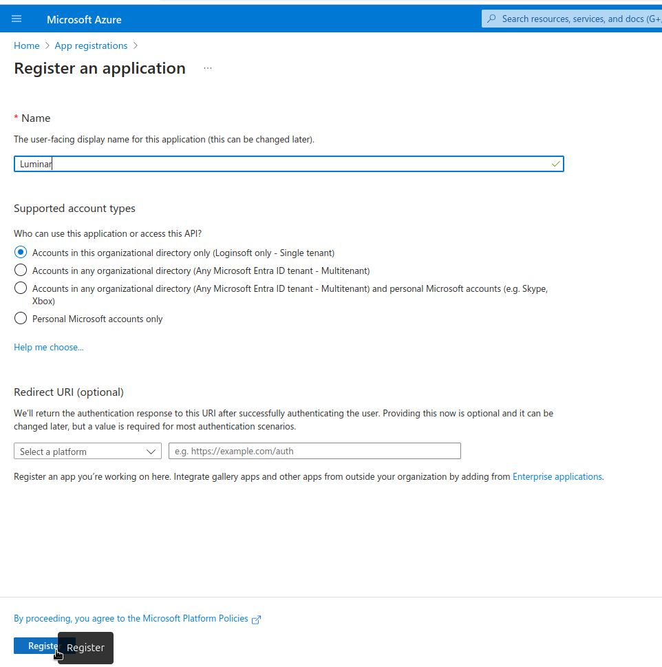

- In the application overview you can see `Display Name`, `Application ID` and `Tenant ID`.
  
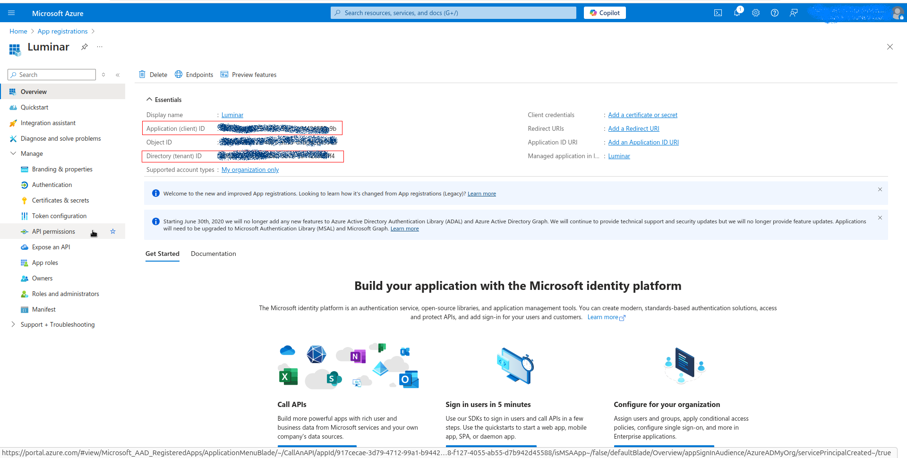

- After creating the application, we need to set API permissions for connector. For this purpose,
  - Click `Manage->API permissions` tab
  - Click `Microsoft Graph` button
  - Search `indicator` and click on the `ThreatIndicators.ReadWrite.OwnedBy`, click `Add permissions` button below.
  - Click on `Grant admin consent`
    

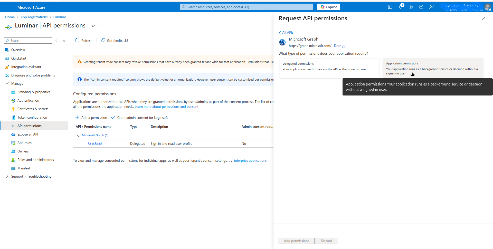
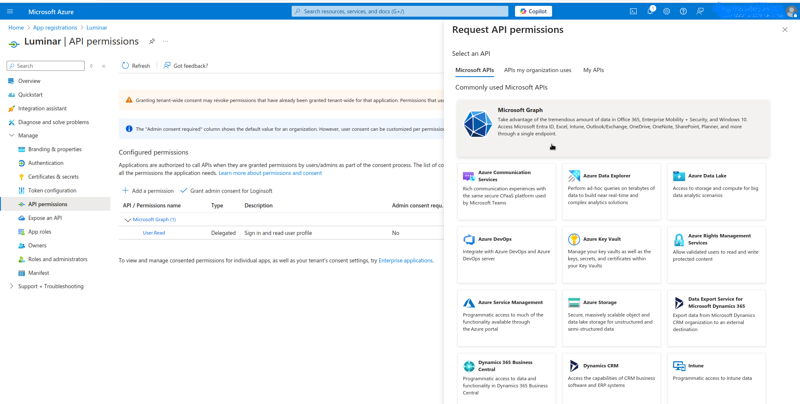
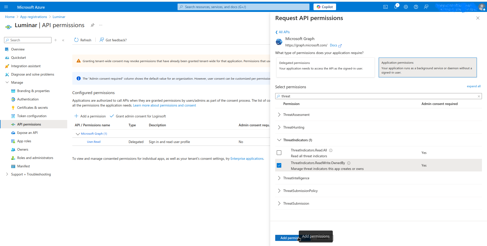
 

- We need to generate client secret for ingesting indicators. For creating secrets
  - Click `Manage->Certificates & secrets` tab
  - Click `Client secrets` tab
  - Click `New client secret` button
  - Enter description and set expiration date for secret
    
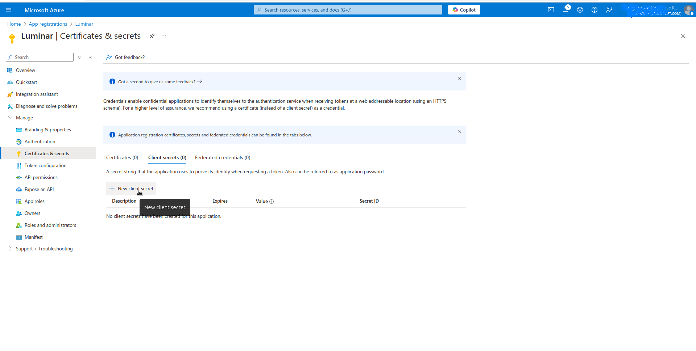
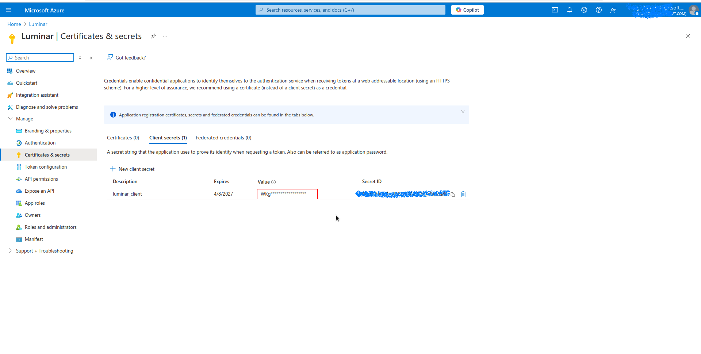

- Use Secret `Value` in Client Secret parameter in configuration.
  

# Deploy Luminar Threat Intelligence from the content hub

- Navigate to your Microsoft Sentinel workspace, open the Content Hub, search for **Luminar Threat Intelligence**, and click Install.

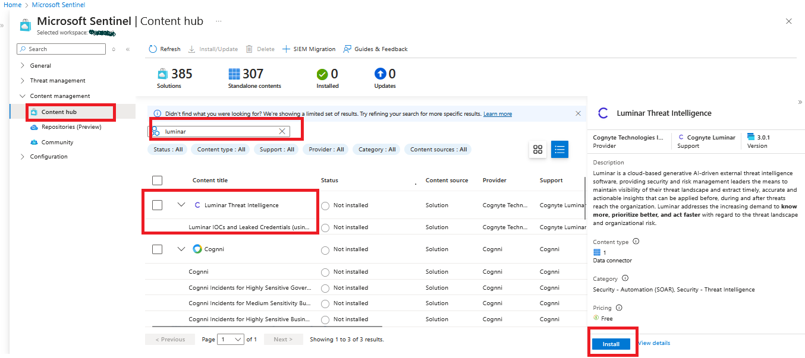

- Once the connector is installed, click on **Manage** to configure its settings.

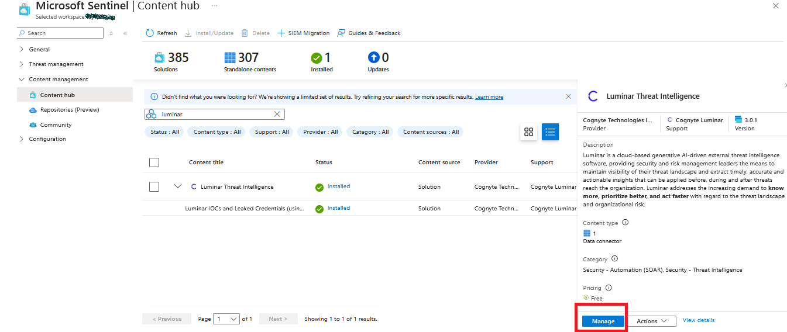

- Click on **Open connector page**, then click on **Deploy to Azure**. You will be redirected to the configuration screen.

  

  

- After deploying the connector successfully, you will see the configuration screen.
  
|       Fields       |   Description |
|:---------------------|:--------------------
| Subscription		| Select the appropriate Azure Subscription    | 
| Resource Group 	| Select the appropriate Resource Group |
| Region			| Based on Resource Group this will be uto populated |
| Function Name		| Please provide a function name if needed to change the default value|
| Application ID | Enter the Azure Client ID created in the App Registration Step |
| Tenant ID | Enter the Azure Tenant ID of the App Registration |
| Client Secret | Enter the Azure Client Secret created in the App Registration Step |
| Luminar API Client ID   | Luminar API Client ID |
| Luminar API Account ID | Luminar API Account ID |
| Luminar API Client Secret | Luminar API Client Secert |
| Luminar Initial Fetch Date | Luminar Initial Fetch Date |
| Time Interval | Time Interval |
| App Insights Workspace Resource ID | Go to `Log Analytics workspace` -> `Settings` -> `Properties`, Copy `Resource ID` and paste here |

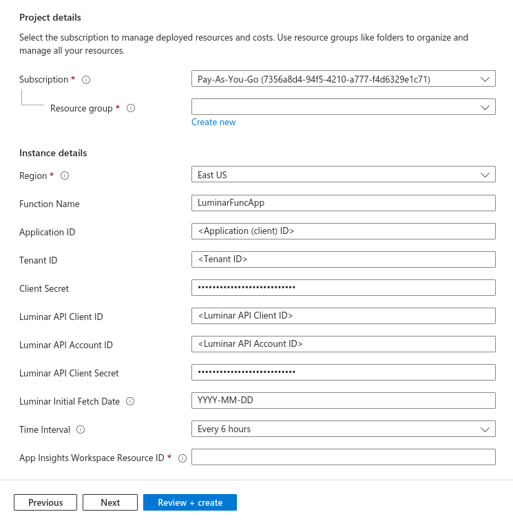

- Once you provide the above values, please click on `Review + create` button.

- Once the threat intelligence function app connector is succussefully deployed, the connector saves the IOCS into the Microsoft Sentinel Threat Intelligence.
- To view the indicators, navigate to your **Microsoft Sentinel workspace** and click on **Threat Intelligence**.

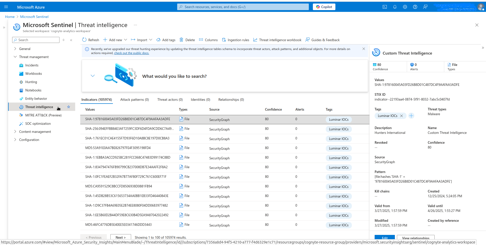
